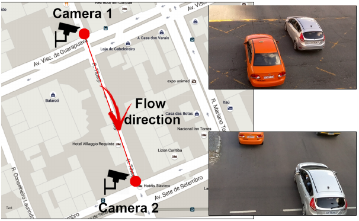
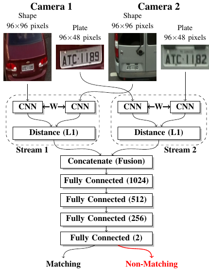

# Demo code for paper "A Two-Stream Siamese Neural Network for Vehicle Re-Identification by Using Non-Overlapping Cameras" (https://arxiv.org/abs/1902.01496)
We describe in this paper a Two-Stream Siamese Neural Network for vehicle re-identification.

The proposed network is fed simultaneously with small coarse
patches of the vehicle shape's, with 96 x 96 pixels, in one stream, and fine features extracted from license plate patches, easily readable by humans,
with 96 x 48 pixels, in the other one.

Then, we combined the strengths of both streams by merging the siamese distance descriptors with a sequence of
fully connected layers, as an attempt to tackle a major problem in the field, false alarms caused by a huge number of car design and models with nearly the same appearance or by similar license plate strings.

In our experiments, with 2 hours of videos containing 2982 vehicles, extracted from two low-cost cameras in the same roadway, 546 ft away, we achieved a F-measure and accuracy of 92.6% and 98.7%, respectively. We show that the proposed network outperforms other One-Stream architectures, even if they use higher resolution image features.

## 1. Installation of the packages
pip install keras tensorflow scikit-learn futures

## 2 Configuration
config.py

## 3.1 generating the dataset
python generate_dataset.py

## 3.2 Format of the dataset
{'trn':[[img1_plate, img1_car, img2_plate, img2_car, label], ...],
'tst':[[img1_plate, img1_car, img2_plate, img2_car, label], ...]}

## 4.1 training of the siamese plate
python siamese.py plate

## 4.2 training of the siamese car
python siamese.py car

## 4.3 training of the siamese two stream
python siamese_two_stream.py

## 5. testing the model with generated dataset or other dataset following the format in 3.2.
python siamese_test.py siamese_original_two_stream.h5 dataset1_1.json
